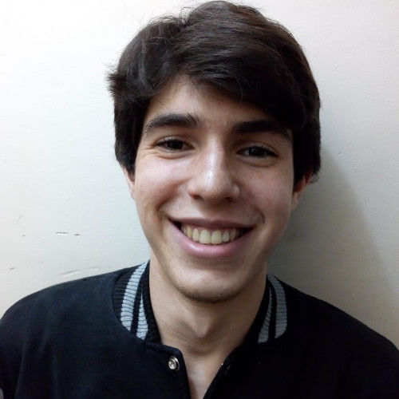

---
# Feel free to add content and custom Front Matter to this file.
# To modify the layout, see https://jekyllrb.com/docs/themes/#overriding-theme-defaults

layout: home
subtitle: "Estagiário em Robótica | Estudante de Engenharia de Automação e Robótica."
---

<h3> {{ page.subtitle}} </h3>


<!--  -->

		

        	

			    
		    
	
        
 Olá, bem vindo! 
 
 
            Sou estudante de Engenharia de Instrumentação Automação e Robótica, juntamente com Ciência da Computação, na UFABC. Ao longo de minha formação, adquiri experiências com robótica móvel, aprendizado de máquina, visão computacional e eletrônica.
        
 
 
            Atuei em projetos de pesquisa na área de SLAM visual, simulação robótica e aplicações em veículos autônomos. Sou capitão da equipe de drones Taphros Drone Systems e presidente do IEEE AESS UFABC. 
        
 

            Atualmente sou estagiário de desenvolvimento para robótica na Automni, onde tenho adquirido experiência com desenvolvimento de software, Linux, UI, ROS e processamento de PointClouds.
            Sou entusiasta de ciência e tecnologia, desenvolvimento pessoal e praticante de Kung Fu. 
         

	

  <link rel="stylesheet" href="main_style.css">

<!--  
     -->
